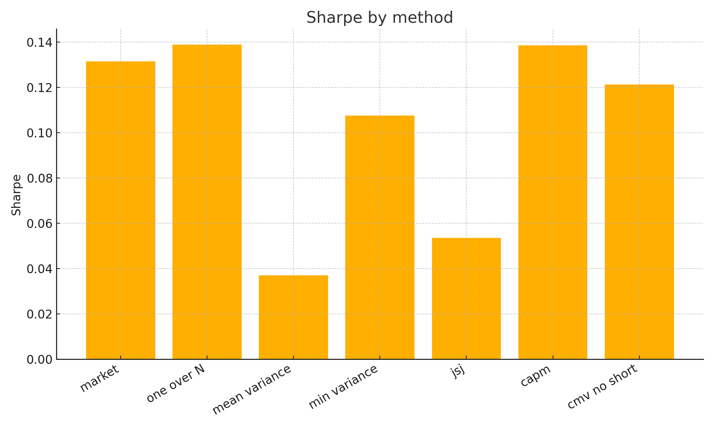
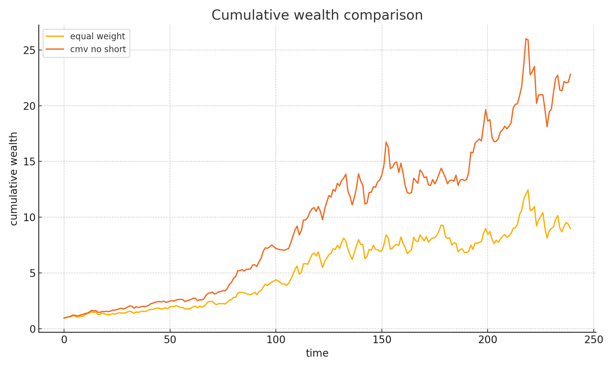

# Sharpe Optimized Portfolio Lab

I built a compact research codebase for practical portfolio construction on liquid assets. The goal is to show a clear path from naive allocation to model driven allocation while keeping the code readable and testable.





## What I built

A small set of reusable modules that estimate moments, compute portfolios, and evaluate performance across multiple approaches. The code runs on synthetic data out of the box and can switch to csv data if you provide it.

## Methods included

i  market portfolio  
ii  equal weight one over N  
iii  mean variance optimal using sample moments  
iv  global minimum variance  
v  James Stein Jorion shrinkage of expected returns  
vi  CAPM based expected returns  
vii  constrained mean variance with no short selling

## Quick start

Create a fresh environment then install dependencies

```bash
pip install -r requirements.txt
```

Run a fast experiment to print the average Sharpe from one synthetic draw

```bash
python run_experiment.py
```

Recreate the figures shown above

```bash
python generate_figures.py
```

## Results from the included synthetic run

The table below is produced with seed equal to 123 and N equal to 50 and T equal to 240

```
market                     0.1314
one over N                 0.1389
mean variance              0.0371
min variance               0.1076
jsj                        0.0535
capm                       0.1385
cmv no short               0.1212
```

## Data options

You can run fully synthetic data for a quick check or drop monthly csvs into the data folder for real assets. Shapes and names are described in data slash README.md. If you do not have permission to share data keep the data folder empty and use the synthetic path shown above.

## Repository layout

```
repo root
  assets
    sharpe_by_method.png
    cumulative_returns.png
  data
    README.md
  notebooks
    Portfolio Sharpe Study.ipynb
  src
    __init__.py
    data_loading.py
    metrics.py
    portfolio.py
    simulation.py
  tests
    test_metrics.py
    test_portfolio.py
  run_experiment.py
  generate_figures.py
  requirements.txt
  LICENSE
  .gitignore
```

## Testing

I added a few small tests so that key helpers behave as expected. You can run them with pytest.

## Notes on design

I kept the modules plain and relied on numpy and scipy. Estimation and portfolio logic live in src and experiments import from there. The notebook is a companion for exploratory work and screenshots.

## License

MIT
